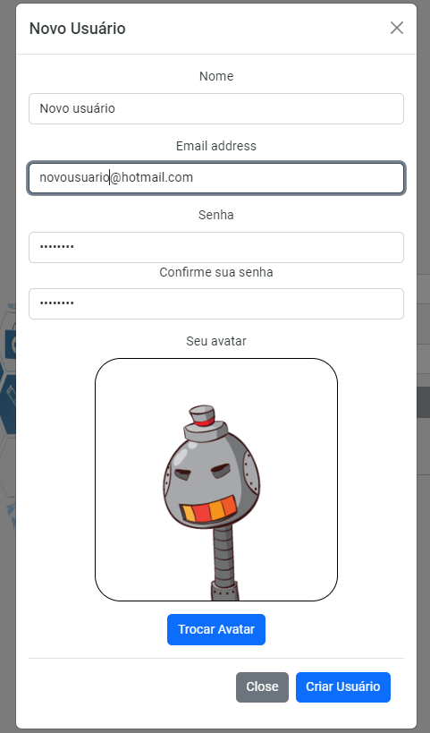
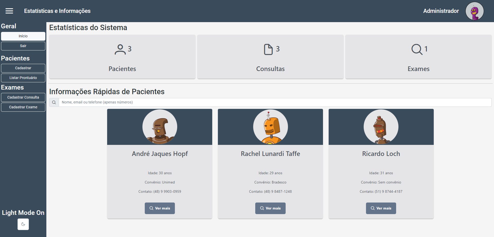

# DEVinKnowledge

## Conteúdos:

- [Introdução](#introdução)
- [Primeiros passos](#primeiros-passos)
- [Entendendo a Aplicação](#entendendo-a-aplicação)
- [Página de Login](#página-de-login)
- [Página Inicial](#página-inicial---estatísticas)
- [Menus](#menus)
- [Listagem de Prontuários](#listagem-de-prontuário)
- [Cadastro de Consulta e Exame](#cadastro-de-consulta-e-exame)
- [Tecnologias Utilizadas e Motivação](#tecnologias-utilizadas-e-motivação)


## Introdução

A LABMedicine LTDA, empresa líder no segmento tecnológico para gestão hospitalar, está com um projeto novo intitulado LABMedical, um software audacioso para gestão de inventário médico. O seu perfil chamou a atenção dos gestores, para criar a aplicação Front-End do software, que deverá ser construída utilizando o framework Angular.

### Primeiros Passos

#### Instalando a aplicação:

Para clonar o repositório para seu ambiente local de desenvolvimento é preciso executar o comando

```bash 
git clone git@github.com:ajhopf/LABMedical.git
```

Para instalar as dependencias é preciso executar o comando npm install dentro da pasta onde o projeto foi clonado

```bash
# Acessar a pasta do projeto
cd LABMedical

# Instalar as dependencias do projeto
npm install
```

#### Instalando o JSON server

Este projeto utiliza o JSON server como banco de dados.

1) Instalando o JSON server

Dentro da pasta que você deseja criar o servidor (não necessariamente na mesma pasta que você instalou a aplicação) rode o seguinte comando:

```bash
npm install json-server
```

2) Crie um arquivo `db.json` com o seguinte conteúdo:

```bash
{
  "doctors": [],
  "pacients": [],
  "appointments": [],
  "exams": []
}
```
Desta maneira o seu aplicativo irá inicializar sem nenhuma dica cadastrada.
Você pode optar por copiar [este arquivo](https://github.com/ajhopf/json-server/blob/main/data/db.json), desta forma já o inicializando com pacientes, consultas e exames cadastrados.

3) Dentro do arquivo `package.json` adicione o seguinte script:

```bash
"start": "json-server --watch data/db.json"
```

4) Inicialize o servidor com o comando start:

```bash
npm start
```

O servidor roda a partir da porta 3000 (a aplicação já está configurada para acessar o servidor por esta porta):

```bash
http://localhost:3000
```

Clique [aqui](https://github.com/typicode/json-server) para mais informações sobre o json-server.

### Você está pronto para iniciar a utilização do LABMedical!

<hr>

## Entendendo a Aplicação

### Página de Login

A página inicial da aplicação é a página de login. Se você optou por utilizar o banco de dados disponibilizado [aqui](https://github.com/ajhopf/json-server/blob/main/data/db.json) você poderá optar por utilizar o login padrão (admin@labmedical.com / admin123) ou criar um novo usuário.

A funcionalidade de esqueci minha senha é disponibilizada ao usuário após uma primeira tentativa de login com credenciais inválidas.


Ao optar por criar um novo usuário um modal será disponibilizado para inserir as informações necessárias. Um avatar da [robohash](https://robohash.org/) será gerado utilizando o email. Você poderá optar por mudar seu avatar até encontrar um do seu agrado!
Ao clicar em criar usuário, é feita uma validação para verificar se o email informado já está em uso.


### Página inicial - Estatísticas

Com o login validado, você terá acesso à página inicial.
Nesta página você poderá verificar a quantidade de pacientes, consultas e exames cadastrados.
Além disso, é possível obter informações rápidas de todos os pacientes e realizar uma busca pelo nome, email  ou telefone do pacientes.

Ao clicar no card do paciente você será direcionado à página de cadastro do paciente com a função editar habilitada, possibilitando atualizar os dados necessários.



### Menus

Uma vez logado, todas as páginas possuem um header com o título da página em que você se encontra, o nome do usuário e o seu avatar. Ao clicar no avatar você poderá se deslogar da aplicação.
Além do header, existe um menu lateral que é disponibilizado ao clicar no menu hamburguer na lateral esquerda do header.
Neste é possível fazer a navegação dentro da aplicação, além de escolher o tema de cores da aplicação.

### Cadastro de Paciente

Nesta página você poderá cadastrar um novo paciente. O botão de cadastrar só será habilitado quando todas as informações necessárias forem preenchidas e validadas.
Os botões de editar cadastro e deletar cadastro só são habilitados quando estamos editando um paciente já cadastrado.

Ao finalizar o cadastro, você verá uma mensagem de confirmação, onde você poderá ver todos as informações e conferi-las.

Por último, antes do cadastro, é realizada uma busca no banco de dados pelo nome do paciente para evitar duplicação de registros.


### Listagem de Prontuário

Na página de prontuários, você poderá pesquisar um paciente pelo seu nome ou pelo número do registro.


Ao clicar em um dos itens da lista você será direcionado à página de registros do paciente, onde poderá ver, em ordem cronológica, todas consultas e exames vinculados àquele paciente.


### Cadastro de Consulta e Exame

Ao entrar na página de cadasto de consultas ou na de cadastro de exame você deverá primeiro selecionar um paciente. Nenhum exame ou consulta poderá ser cadastrado sem estar vinculado a um paciente.

O botão de cadastrar só será habilitado uma vez que todas informações necessárias sejam preenchidas.

Para editar ou deletar uma consulta ou exame você deverá selecioná-lo primeiro na página de registros de um paciente.


<hr>

## Tecnologias Utilizadas e Motivação

Este projeto foi desenvolvido como projeto avaliativo do fim do módulo de front-end da formação full-stack do curso DEVinHouse do Senai, patrocinado pela phillips.

O framework escolhido para o desenvolvimento foi o Angular, sendo utilizado:

- Roteamento para gerenciamento de rotas;
- Services para centralização de código;
- Validators para validação avançada de inputs de usuários;
- Observables para comunicação com o back-end (JSON server);
- Manipulação do local-storage para persistência de dados locais (usuário logado e tema de cores);
- Guards de rotas;
- Tipagem do typescript e uso de models;
- Componentização e sistema de pastas para organização dos arquivos.

Para estilização foram utilizados:

- [Bootstrap](https://getbootstrap.com/);
- [PrimeNg](https://primeng.org/);

Durante o desenvolvimento foi utilizado o github como versionador de código, com padrão baseado em gitflow, utilizando a main como branch principal do projeto e criando novas branches para features, estilização e revisão de código.
Além disso, foram utilizados commits curtos, concisos e auto-explicativos.

Para organização das tarefas um [board do trello](https://trello.com/b/4FbH6Ojs/devinhouse-projeto-2) foi utilizado, com estrutura kanban para organização das tarefas.
